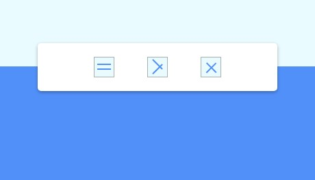

  

  
   
  
  

# Animated-Navigation-Bar
A Web Effect project which shows a smooth animation for the expansion &amp; the collapse of a navigation bar
This project have two worth mentioning concept
- The Navigation Button
- The Animation of the Navigation Bar

  

# Concept 1: The Navigation Button

  

The button in this project undergoes a transformation to morph from a hamburger button to a navigation close button.  
Here's a brief explanation of the transformation:

- Initially, the button consists of two horizontal lines representing the hamburger icon.
- When the navigation menu is in the closed state, the lines transform to create an "X" shape, resembling a close button.
- The first line rotates by 45 degrees clockwise and translates slightly to create the diagonal line of the "X".
- The second line rotates by 45 degrees counterclockwise and translates slightly to form the other diagonal line of the "X".
- Additionally, the second line is positioned slightly lower to create a visual distinction between the two lines.
- This transformation gives the appearance of the button changing from a hamburger icon to a close icon, indicating the ability to open and close the navigation menu's visibility.

This morphing effect provides a clear visual cue to the user,  
allowing them to easily recognize and interact with the button  
to toggle the navigation menu's visibility.

# Concept 2: The Animation of the Navigation Bar
The navigation bar in this project undergoes a transition from a hidden state to a visible state with the following transformations:

- The width of the navigation bar is reduced over a duration of 0.6 seconds.
- The navigation bar's overflow is set to "hidden" to ensure content remains within its boundaries.
- The width of the navigation list (ul element) is animated to zero width over a duration of 0.6 seconds.
- The navigation links themselves rotate by 360 degrees (one full rotation) with a duration of 0.6 seconds.
- The navigation links content gradually fades out with an opacity transition over 0.6 seconds.
- Each line of the button icon rotates by 720 degrees (equivalent to two full rotations) with a duration of 0.6 seconds.

These coordinated transitions, each with a duration of 0.6 seconds, contribute to a cohesive and visually engaging transformation from a hidden navigation bar to a visible one, creating an intuitive and aesthetically pleasing user experience.

